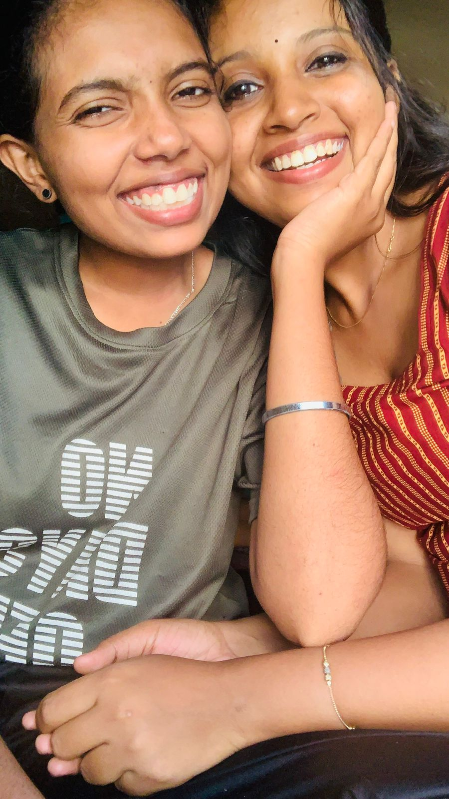

<!DOCTYPE html>
<html lang="en">
<head>
  <meta charset="UTF-8">
  <meta name="viewport" content="width=device-width, initial-scale=1.0">
  <title>From My Heart to Achu ❤️</title>
  <link rel="stylesheet" href="style.css">
</head>
<body>

  <!-- Background Music -->
  <audio id="bgMusic" src="song.mpeg" preload="auto"></audio>

  

    <!-- Screen 1 -->
    

      <h1>Achu 🤍</h1>
      

        This page exists because  
        my heart refused to stay silent…
      

      <button onclick="nextScreen()">Tap gently 💖</button>
    

    <!-- Screen 2 -->
    

      

        Achu, every kilometer between us  
        only proves one thing…
          
        My love for you is stronger than distance.
      

      <button onclick="nextScreen()">Continue 🌙</button>
    

    <!-- Screen 3 -->
    

      

        You are in Bangalore,
         
        but my heart wakes up  
        and sleeps only with your name.
      

      <button onclick="nextScreen()">Feel this 🤍</button>
    

    <!-- Screen 4 : Distance -->
    

      <h2>Us, no matter what 🌍</h2>
      

        Me
        

        Bangalore
      

      

        Distance in kilometers: countless  
         
        Distance in hearts: none
      

      <button onclick="nextScreen()">Memories 📸</button>
    

    <!-- Screen 5 : Photo Gallery -->
    

      <h2>Every photo, a heartbeat 💗</h2>

      

        
        
        
        
        
        
        
        
      

      <button onclick="nextScreen()">One last thing 💌</button>
    

    <!-- Screen 6 : Ending -->
    

      

        Achu, no matter where life places us,
          
        you will always be my safe place,
        my peace,
        my home.
      

      

        Call me after this…
         
        I’ll be right here, loving you 🤍
      

    

  

  
</body>
</html>
